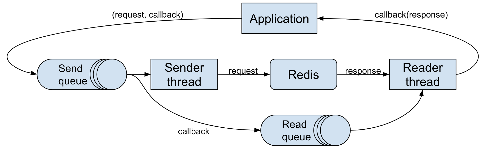
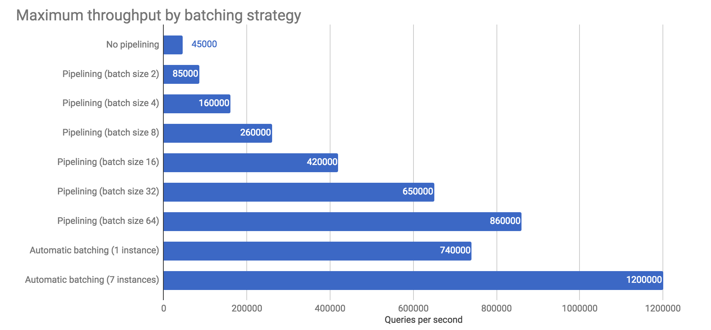

# Redis client benchmark

Goal of this project is to check the actual limit of RPS that Redis can achieve.
Initial results show that it can quite easily process 750000 GET/SET queries per second on a single instance,
and even 1250000 RPS with multiple processes on a single machine.

As it turns out, Redis can keep up with a very high load and it is likely that the client code or network bandwidth
are going to be the source of performance problems.

In a classic approach with synchronous I/O every read or write needs to make a context switch, which quickly becomes
a bottleneck. This is why pipelining is commonly used, which allows to make many requests with a single call, but
application business logic must explicitly support it.

This projects contains two new clients that make use of idea of [smart batching](https://mechanical-sympathy.blogspot.com/2011/10/smart-batching.html)
that greatly improves throughput. This technique does not force changes in client code, the only requirement is that
code needs to be asynchronous. It takes advantage of the fact that Redis processes requests in FIFO order,
so reads and writes can be easily batched.

## Smart batching

Client threads put queries and callbacks into a queue Multi-Producer-Single-Consumer queue. Separate threads are responsible for making I/O calls.
Writer thread drains all available messages from the queue and tries to make as many requests at once, in a similar way as in pipelining.
Responses are also read in batches and then callbacks are called. This massively reduces the number of system calls and context switches.



### Synchronous client

`pl.msulima.redis.benchmark.io.SyncClient`

Uses LMAX Disruptor to queue messages and blocking input/output streams for network communication. This greatly
simplifies serialization code, because Jedis implementation could be reused. Needs two threads: writer and reader.

### Nonblocking client

`pl.msulima.redis.benchmark.nonblocking.NonblockingClient`

Uses Agrona's MPSC queue and Java NIO for networking. Both input and output are done in a single thread,
so custom asynchronous Redis protocol reader/writes was needed.
This client achieves similar throughput as synchronous client, but with lower CPU usage.

### Jedis client

Very popular Jedis client was used as a baseline. It was tested with different numbers of pipeline sizes to show
the effect of reducing number of system calls.

## Results

Benchmark consists of 80% reads and 20% writes of 100 bytes messages with 20 bytes keys.
Tests were performed at 2xlarge AWS instances with 8 cores (one instance for client and one Redis host).



Further improvement might be achieved, but at ~1250000 rps we hit bandwidth limit of 1Gbps.
Tests could be repeated on [better machines](https://docs.aws.amazon.com/AWSEC2/latest/UserGuide/ebs-ec2-config.html).

## Setup

See `redis-setup.sh`.

To run JMH tests in IntelliJ IDEA enable annotations processing.

### Redis in docker

```shell script
for i in 6379 6380; do docker run --name redis-$i -p $i:$i -d redis --port $i --bind 0.0.0.0; done
```

### Configuring JVM assembly profiler

Based on https://metebalci.com/blog/how-to-build-the-hsdis-disassembler-plugin-on-ubuntu-18/

```shell script
sudo apt install texinfo
wget https://download.java.net/openjdk/jdk11/ri/openjdk-11+28_src.zip
# unzip
cd openjdk/src/utils/hsdis
wget https://ftp.gnu.org/gnu/binutils/binutils-2.33.1.tar.gz
tar -zxvf binutils-2.33.1.tar.gz
export BINUTILS=binutils-2.33.1
make all64
sudo cp build/linux-amd64/hsdis-amd64.so /usr/lib/jvm/java-11-openjdk-amd64/lib
```

Fix compilation error in `hsdis.c` with:
```c
app_data->dfn = disassembler(bfd_get_arch(native_bfd),
                             bfd_big_endian(native_bfd),
                             bfd_get_mach(native_bfd),
                             native_bfd);
```


### Running perf profiler

```shell script
echo -1 | sudo tee /proc/sys/kernel/perf_event_paranoid
export FLAMEGRAPH_DIR=/home/msulima/code/FlameGraph/
export PERF_RECORD_SECONDS=120
./gradlew installDist; build/install/redis-client/bin/redis-client &; sleep 45; ../perf-map-agent/bin/perf-java-flames $(ps aux | grep PreserveFramePointer | grep -v grep | awk '{ print $2 }')
```

