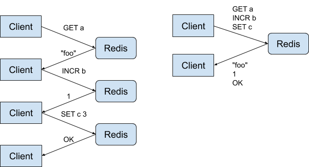
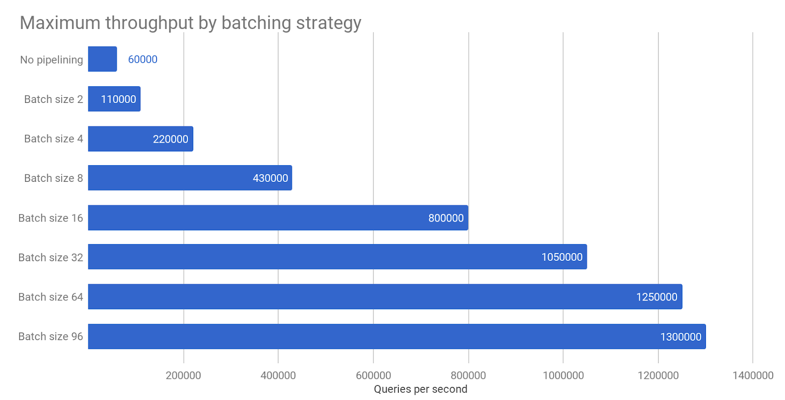
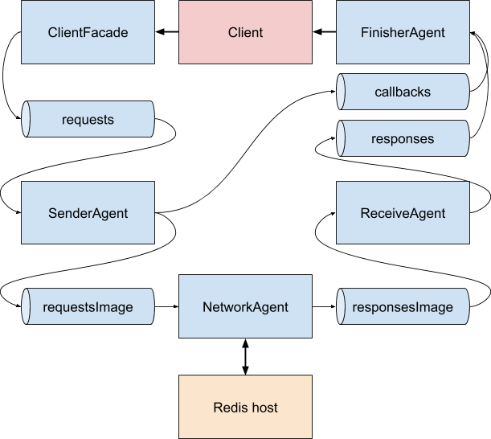

# Redis client benchmark

Goal of this project is to check the actual limit of RPS that Redis can achieve.
Initial results show that it can quite easily process 750000 `GET`/`SET` queries per second on a single instance,
and even 1250000 RPS with multiple processes on a single machine.

As it turns out, Redis can keep up with a very high load and it is likely that the client code or network bandwidth
are going to be the source of performance problems.

In a classic approach with synchronous I/O every read or write needs to make a context switch, which quickly becomes
a bottleneck. This is why pipelining is commonly used, which allows to make many requests with a single call, but
application business logic must explicitly support it.

This projects contains two new clients that make use of idea of [smart batching](https://mechanical-sympathy.blogspot.com/2011/10/smart-batching.html)
that greatly improves throughput. This technique does not force changes in client code, the only requirement is that
code needs to be asynchronous. It takes advantage of the fact that Redis processes requests in FIFO order,
so reads and writes can be easily batched.

## Smart batching

Client threads put queries and callbacks into a queue Multi-Producer-Single-Consumer queue. Separate threads are responsible for making I/O calls.
Writer thread drains all available messages from the queue and tries to make as many requests at once, in a similar way as in pipelining.
Responses are also read in batches and then callbacks are called. This massively reduces the number of system calls and context switches.


### Synchronous client

`pl.msulima.redis.benchmark.io.SyncClient`

Uses LMAX Disruptor to queue messages and blocking input/output streams for network communication. This greatly
simplifies serialization code, because Jedis implementation could be reused. Needs two threads: writer and reader.

### Nonblocking client

`pl.msulima.redis.benchmark.nonblocking.NonblockingClient`

Uses Agrona's MPSC queue and Java NIO for networking. Both input and output are done in a single thread,
so custom asynchronous Redis protocol reader/writes was needed.
This client achieves similar throughput as synchronous client, but with lower CPU usage.

### Jedis client

Very popular Jedis client was used as a baseline. It was tested with different numbers of pipeline sizes to show
the effect of reducing number of system calls.

## Results

Benchmark consists of 80% reads and 20% writes of 100 bytes messages with 20 bytes keys.
Tests were performed at 2xlarge AWS instances with 8 cores (one instance for client and one Redis host).


Further improvement might be achieved, but at ~1250000 rps we hit bandwidth limit of 1Gbps.
Tests could be repeated on [better machines](https://docs.aws.amazon.com/AWSEC2/latest/UserGuide/ebs-ec2-config.html).

## Setup

See `redis-setup.sh`.

To run JMH tests in IntelliJ IDEA enable annotations processing.

### Redis in docker

```shell script
for i in 6379 6380; do docker run --name redis-$i -p $i:$i -d redis --port $i --bind 0.0.0.0; done
```

### Configuring JVM assembly profiler

Based on https://metebalci.com/blog/how-to-build-the-hsdis-disassembler-plugin-on-ubuntu-18/

```shell script
sudo apt install texinfo
wget https://download.java.net/openjdk/jdk11/ri/openjdk-11+28_src.zip
# unzip
cd openjdk/src/utils/hsdis
wget https://ftp.gnu.org/gnu/binutils/binutils-2.33.1.tar.gz
tar -zxvf binutils-2.33.1.tar.gz
export BINUTILS=binutils-2.33.1
make all64
sudo cp build/linux-amd64/hsdis-amd64.so /usr/lib/jvm/java-11-openjdk-amd64/lib
```

Fix compilation error in `hsdis.c` with:
```c
app_data->dfn = disassembler(bfd_get_arch(native_bfd),
                             bfd_big_endian(native_bfd),
                             bfd_get_mach(native_bfd),
                             native_bfd);
```


### Running perf profiler

```shell script
echo -1 | sudo tee /proc/sys/kernel/perf_event_paranoid
export FLAMEGRAPH_DIR=/home/msulima/code/FlameGraph/
export PERF_RECORD_SECONDS=120
./gradlew installDist; build/install/redis-client/bin/redis-client &; sleep 45; ../perf-map-agent/bin/perf-java-flames $(ps aux | grep PreserveFramePointer | grep -v grep | awk '{ print $2 }')
```


### Introduction

Redis is a popular database, well-known for its speed and simplicity. It’s often used as a cache,
despite many other features. In this article, I try to check what are its performance limits.
The purpose is not to compare Redis to other solutions, but to show that many performance
issues may be caused by client code and not the database itself.

Benchmarks are hard, even the author of Redis [says that](http://antirez.com/news/85)
they are “misleading beasts”. Different applications have different characteristics.
Performance heavily depends on load, data access patterns, and types of requests.
Redis can do a lot more than simple `GET`/`SET` operations, and likely applications will use
a lot of other features.

Another problem is the architecture of the benchmark itself. It is hard to design in a way that
the generated load resembles production traffic. Moreover, when we reach hundreds of thousands
of requests per second, it is feasible that the benchmark itself becomes the biggest bottleneck.
The tool I’ve written may not give the most accurate numbers, nevertheless in my opinion it shows
the nature of some problems that occur in real-life applications.

### Pipelining

In the beginning, I will check how pipelining impacts Redis performance. It is a technique in which
a client sends a few queries at once. It does not wait for a response after each query but reads all
responses together. This approach is a widely used way to improve throughput.

The diagram below on the left shows example queries executed one-by-one. On the right side,
the same queries are executed using pipelining. These queries have lower latency, because we save
two round trips from the client to the server and back again.



It's also important that pipelining reduces the number of system calls. When application makes hundreds of thousands
reads/writes per second, the program spends most of it's CPU time on switching between user and kernel space.

### Baseline

In the first test, I will measure how batch size in pipelining affects the maximum achievable throughput.
The experiment uses a popular Jedis client which makes GET and SET queries to a single Redis
instance on another host. Both client and server hosts are AWS `c5n.xlarge` instances with 4 cores, deployed in
the same availability zone. The client uses 500 connections, requests are 80% writes and 20% reads.
Keys have 20 bytes and values have 80 bytes each.

In a single test, the client makes requests with a given throughput for 5 minutes (with short warm-up time).
I run multiple tests with different numbers of queries in a single pipelined request (batch size).
The diagram below shows the highest throughput values at which the system remained stable for a given batch size.
I double-checked values reported by the benchmark with `instantaneous_ops_per_sec` metric from
Redis `INFO` command output.



The chart clearly shows that the more queries in a pipeline, the higher throughput,
although the growth is not linear. For large batch sizes, Jedis can achieve pretty impressive
performance, even when connected to a single Redis instance.

At 1.3 million requests per second Redis’ CPU utilization reaches almost 100% and this becomes a bottleneck.
This shows that for batch sizes smaller than 32 the bottleneck is in the client itself.
So to fully utilize our database capabilities programs should make calls with several dozens of
queries in a batch.

Unfortunately in real-world applications, it is often difficult to batch together so many queries.
Many programs execute queries to the database one-by-one, often because reads and writes depend on
values that were read previously (data dependencies). On the chart, we can see that in this way
it's hard to achieve even 5% of the maximum throughput.

### Implementation overview

So far we have learned that large batches are the key to high throughput. That’s mostly because
batching limits the number of system calls made. Let’s check if the client may automatically
handle batching for us.

The solution described below requires that the driver can’t just block a thread waiting for a response.
It’s necessary to switch to an asynchronous model and use callbacks (or promises/futures).
When a client sends a request it must also pass a callback function to the driver.
After a response comes back from the server this function is called with a result.

The diagram below shows a high-level view of the client. Components are connected with queues.



The driver consists of the following parts:
* `ClientFacade` &mdash; controls establishing and closing connections. It exposes an interface with
regular Java methods that return a promise with a response. `ClientFacade` translates these
method calls into requests it puts into `SenderAgent`’s queue. 
* `SenderAgent` &mdash; serializes requests to Redis protocol format and writes them to `requestImage`,
which is a kind of cyclic buffer, but optimized to be garbage collector-friendly.
This agent also puts response callbacks to a `FinisherAgent` queue.
* `NetworkAgent` &mdash; wraps two components:
  * `SendChannel` &mdash; transfers data from `requestImage` to the network socket connected to Redis host.
  * `ReceiveChannel` &mdash; transfers data from the selector to `responseImage`.
* `ReceiveAgent` &mdash; deserializes responses in Redis protocol format and puts them into
`FinisherAgent`’s queue.
* `FinisherAgent` &mdash; joins responses from `ReceiverAgent` with callbacks from
`SenderAgent` and invokes them.

### Implementation details

The main principle that drives this implementation is that there should be as little shared state
between CPU cores as possible. At a scale of multiple million events per second synchronization
becomes very expensive. It turns out that it’s more effective to make single-threaded
components and connect them with queues only when a single CPU core is not enough to keep up with computations.

This design is heavily inspired by [Aeron](https://github.com/real-logic/aeron), which is probably
the fastest messaging solution on the market. I couldn’t use Aeron itself, because
the server needs to support its protocol, but I’ve adapted a lot of its concepts to Redis.

All the driver components, except ClientFacade, implement an Agent interface.
Agents communicate through queues with control commands and requests.
Commands manage agents’ state, for example, they open and close connections.
Request queues are designed to conform to
the [Single Writer Principle](https://mechanical-sympathy.blogspot.com/2011/09/single-writer-principle.html).
When queues have just one producer and one consumer, it allows for some optimizations.
[Benchmarks](http://psy-lob-saw.blogspot.com/p/lock-free-queues.html) show that
Single-Producer/Single-Consumer queues are multiple times faster than Multiple-Producers/Multiple-Consumer queues.

The driver uses the fact that Redis handles queries in a First In First Out order.
This means that requests cannot be reordered with requests and simple FIFO queues are enough to track
requests and responses, which greatly simplifies implementation.

Another important insight is that agents don’t have to pull requests from queues one by one.
It’s more effective to extract all waiting requests from the queue to a temporary buffer and process
them at once. This technique has been described by Martin Thompson, which he called
[Smart Batching](https://mechanical-sympathy.blogspot.com/2011/10/smart-batching.html).
It greatly reduces contention on shared resources, which is particularly important when
writing/reading data to/from a network socket, because each operation invokes a system call,
and a context switch.

### Benchmarks

Let’s compare results for pipelining with results for smart batching.
I also included tests where Redis run on AWS `z1d.large` instance, which has a higher CPU clock speed.

-- obrazek

The smart batching solution achieves performance even better than one using very large pipelines. 
Response times at 1.5 million operations per second looked as follows:
 
| Statistic | Response time |
|-----------|---------------|
| 50th percentile |  2.659 ms |
| mean | 2.910 ms |
| 75th percentile | 3.609 ms |
| 95th percentile | 4.985 ms |
| 99th percentile | 8.477 ms |
| 99.9th percentile |5.743 ms |
| 99.99th percentile | 22.072 ms |
| 99.999th percentile | 23.703 ms |
| max | 24.578 ms |

At this point, it’s worth mentioning that a smart batching approach is going to be more scalable.
Further scaling can be achieved by creating more connections, which will create new agents and new agent threads.

### Future work

The source code of the client is available on [GitHub](https://github.com/msulima/redis-client).
It should be noted that it is just a proof-of-concept.
Current implementation needs backpressure support, better exception handling, and Redis cluster support.
I didn’t test it for very large keys, i.e. 512MB which is a maximum supported by Redis.

Currently, only `GET` and `SET` commands are supported. It is a very small subset of Redis’ capabilities.
Another drawback is that an asynchronous approach would require special handling of
blocking operations like `BLPOP`. Redis cluster support would also be a nice feature.

### Conclusions

When we compare results for the simplest approach with no batching to results for automatic batching,
we see that the latter gives us an order-of-magnitude increase in throughput.
The tests have shown how fast Redis is &mdash; the bottleneck was actually in the client code,
more specifically in the way it accessed the network stack.

The proof-of-concept of automatic batching shows how simple engineering practices,
known for many years, allow us to achieve a great speedup.
What is more, the tests were done on a pretty cheap cloud machine.
That shows that modern hardware is really fast, but some optimizations are needed to get the best performance.
